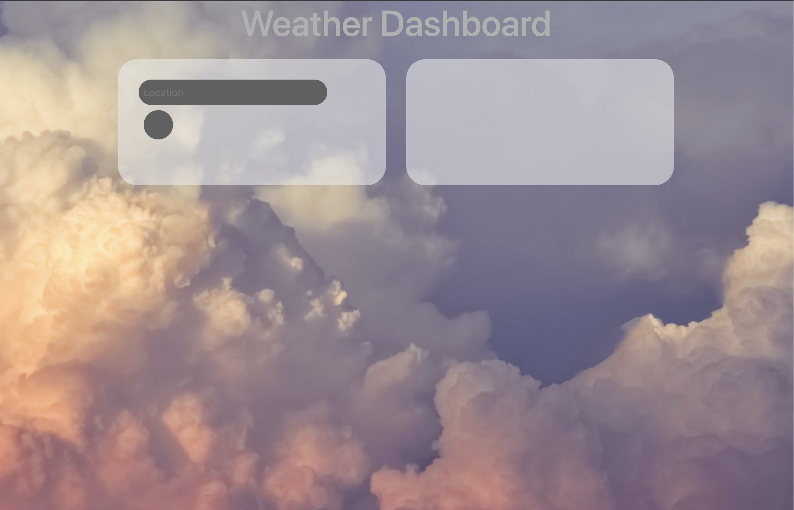

# 06-Server-Side-API-Weather-Dashboard-Challenge

## Description

For this project we were tasked to create a weather dashboard site that pulled information from an api amd displayed the weather for that area the user inputs.

What I did was created a container with a search field that would also hold all of the data from the weather api. Then I went and styled it to make it more interesting to the user. I also used the Unsplash Api for my background of the site with the keywork "clouds" That way whenever the user refreshs the page a new random image is displayed to give them a different experience every time.

Then I set up the function so when the api is called it goes through the DOM and selects the specific elements in the HTML.

For this application I was able to display the current weather but not the forecast. What I will do is go back and adjust it so that the forecast is displayed and functions properly.

## links

Deployed Site:
https://christianmsm.github.io/06-Server-Side-API-Weather-Dashboard-Challenge/

GitHub Repo:
https://github.com/Christianmsm/06-Server-Side-API-Weather-Dashboard-Challenge

Screenshot:

## Credits

https://openweathermap.org/forecast5#5days

https://unsplash.com/developers

## License

MIT License

Copyright (c) 2023 Christianmsm

Permission is hereby granted, free of charge, to any person obtaining a copy
of this software and associated documentation files (the "Software"), to deal
in the Software without restriction, including without limitation the rights
to use, copy, modify, merge, publish, distribute, sublicense, and/or sell
copies of the Software, and to permit persons to whom the Software is
furnished to do so, subject to the following conditions:

The above copyright notice and this permission notice shall be included in all
copies or substantial portions of the Software.

THE SOFTWARE IS PROVIDED "AS IS", WITHOUT WARRANTY OF ANY KIND, EXPRESS OR
IMPLIED, INCLUDING BUT NOT LIMITED TO THE WARRANTIES OF MERCHANTABILITY,
FITNESS FOR A PARTICULAR PURPOSE AND NONINFRINGEMENT. IN NO EVENT SHALL THE
AUTHORS OR COPYRIGHT HOLDERS BE LIABLE FOR ANY CLAIM, DAMAGES OR OTHER
LIABILITY, WHETHER IN AN ACTION OF CONTRACT, TORT OR OTHERWISE, ARISING FROM,
OUT OF OR IN CONNECTION WITH THE SOFTWARE OR THE USE OR OTHER DEALINGS IN THE
SOFTWARE.

## Features

This application features:
fontawesome.com
openweatherapi
unsplashapi