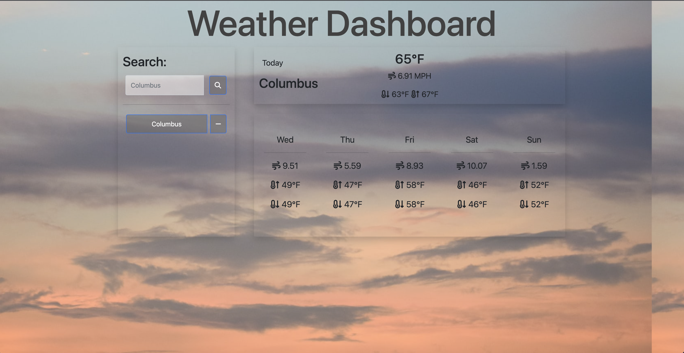

# 06-Server-Side-API-Weather-Dashboard-Challenge

 ## Table of Contents
 - [Project Description](#Description)
 - [Usage](#Usage)
 - [Installation](#Installation)
 - [Contribution](#Contribution)
 - [GitHub](#GitHub)
 - [Email](#Email)
 - [License](#License)
  
## Description
For this project we were tasked to create a weather dashboard site that pulled information from an api and displayed the weather for that area the user inputs.

My first version of this application only displayed the current weather of the specific city the user inputted, it was not where I wanted it to be. Since then I have grown my knowledge and understanding of JavaScript and now present version 2.0. What I did was went back to revamp and polished up everything so now it shows the user the current weather and a 5 day forecast for that specified location. It also saves the cities that were searched in a column on the left hand side of the screen.

For the styling I kept it mostly the same as I had, with a few tweaks. This application still pulls from the Unsplash API for a different background image every time a user revisits or refreshes the page. Creating a new and exciting experience every time. 
The containers for the various sections were left fairly the same, with minor adjustments and adding the FontAwesome CDN to the application for more interesting imagery. 

This application is for anyone who is planning a trip to travel somewhere and wants to see the weather of where they will be traveling and keep that information stored to look at it again and again.

## Usage
Open the application and in the `Search` box type in a location you would like to display the weather for.
The weather will be displayed and if you would like to remove that city from your saved list click the `-` to remove it.

## Technologies

## Installation
Clone the repository

## Contribution
Currently there are no contributions being taken.

## Resources
Screenshot:

Deployed Site:
https://christianmsm.github.io/06-Server-Side-API-Weather-Dashboard-Challenge/

API's:
https://openweathermap.org/forecast5#5days
https://unsplash.com/developers

## GitHub
Christianmsm:
https://github.com/Christianmsm/06-Server-Side-API-Weather-Dashboard-Challenge
## Email
hello@itschristiansmith.com
## License

Copyright (c) 2023 Christianmsm

Permission is hereby granted, free of charge, to any person obtaining a copy
of this software and associated documentation files (the "Software"), to deal
in the Software without restriction, including without limitation the rights
to use, copy, modify, merge, publish, distribute, sublicense, and/or sell
copies of the Software, and to permit persons to whom the Software is
furnished to do so, subject to the following conditions:

The above copyright notice and this permission notice shall be included in all
copies or substantial portions of the Software.

THE SOFTWARE IS PROVIDED "AS IS", WITHOUT WARRANTY OF ANY KIND, EXPRESS OR
IMPLIED, INCLUDING BUT NOT LIMITED TO THE WARRANTIES OF MERCHANTABILITY,
FITNESS FOR A PARTICULAR PURPOSE AND NONINFRINGEMENT. IN NO EVENT SHALL THE
AUTHORS OR COPYRIGHT HOLDERS BE LIABLE FOR ANY CLAIM, DAMAGES OR OTHER
LIABILITY, WHETHER IN AN ACTION OF CONTRACT, TORT OR OTHERWISE, ARISING FROM,
OUT OF OR IN CONNECTION WITH THE SOFTWARE OR THE USE OR OTHER DEALINGS IN THE
SOFTWARE.